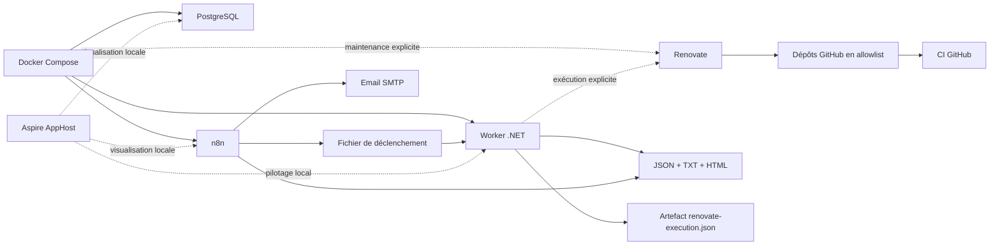

# Architecture cible

`repo-ops` fournit un socle centralisé pour piloter la maintenance de plusieurs dépôts GitHub publics personnels sans couplage fort avec chacun d’eux. Le dépôt est centré sur une couche métier `.NET`, conserve `Docker Compose` comme base d’exécution réelle et utilise `Aspire` comme couche locale de pilotage.

## Principes directeurs

- `Docker Compose` reste la référence d’exécution locale réelle du socle.
- `Aspire` sert au pilotage local, à la visualisation et au confort de développement.
- le worker `.NET` devient la source de vérité du reporting ;
- `n8n` reste utile pour les cron, les déclenchements simples et les notifications ;
- `Renovate` reste la brique dédiée à la maintenance automatisée des dépendances ;
- les scripts existants sont maintenus hors du flux réel principal.

## Flux réel retenu

1. `n8n` déclenche un workflow quotidien.
2. Le workflow écrit un fichier de trigger partagé.
3. Le worker `.NET`, maintenu en veille légère, détecte ce trigger.
4. Le worker charge le dernier résultat connu d’une exécution explicite de `Renovate`, sans relancer `Renovate` dans ce cycle quotidien.
5. Le worker produit les artefacts de sortie :
   - JSON stable
   - texte
   - HTML
6. `n8n` lit le JSON frais du worker après purge des anciens artefacts.
7. `n8n` envoie l’email à partir du digest déjà produit.

## Rôles des composants

### Docker Compose

[`docker-compose.yml`](../docker-compose.yml) exécute la stack réellement prévue pour le socle.

Par défaut :

- `worker` ;
- `postgres` ;
- `n8n`.

`Renovate` est conservé dans le même fichier, mais derrière un profil explicite de maintenance.

### Worker .NET

[`src/RepoOps.Worker`](../src/RepoOps.Worker) porte la logique métier :

- construction du rapport ;
- rendu du digest ;
- persistance des sorties ;
- mode `run once` exploitable localement ;
- détection d’un trigger simple dans `runtime/`.

Dans l’état actuel, le worker :

- lit `RENOVATE_REPOSITORIES` ;
- interroge GitHub via `GITHUB_TOKEN` ;
- produit un rapport JSON structuré stable ;
- sépare les modèles métier, le rendu du digest et la persistance ;
- génère un sujet, un texte brut et un HTML simples ;
- récupère les PR Renovate ouvertes, les PR Renovate fusionnées récemment et les fermetures récentes sans fusion ;
- qualifie les PR ouvertes en `readyForReview`, `blocked` ou `failedChecks` à partir des check-runs et du statut combiné ;
- peut émettre le JSON sur `stdout` en mode explicite.

### Aspire AppHost

[`src/RepoOps.AppHost`](../src/RepoOps.AppHost) apporte une couche de pilotage local pour Visual Studio et le tableau de bord Aspire.

L’AppHost permet de visualiser localement :

- le projet `worker` ;
- `postgres` ;
- `n8n`.

Choix volontaire dans ce lot : `Renovate` reste hors AppHost. La maintenance explicite continue de relever de `Docker Compose`.

### Renovate

`Renovate` self-hosted détecte les dépendances obsolètes ou vulnérables puis ouvre des pull requests de maintenance sur une allowlist explicite de dépôts.

Dans ce lot :

- il ne tourne plus en boucle infinie ;
- il est déclenché explicitement via le worker `.NET`, qui appelle `docker compose --profile maintenance run --rm renovate` ;
- son dernier résultat connu est persistant et réutilisable par le flux quotidien ;
- il reste attaché au runtime Compose.

### n8n

`n8n` orchestre :

- les déclenchements planifiés ;
- le déclenchement simple du worker via un fichier partagé ;
- la lecture du rapport produit ;
- l’envoi des notifications par email.

Le workflow versionné ne reconstruit plus la synthèse métier. Il se contente de consommer le digest du worker et de l’envoyer.

### Scripts transitoires

Les scripts du dossier `scripts/` restent présents comme utilitaires transitoires, mais ne font plus partie du flux réel retenu pour le reporting quotidien.

## Exécution explicite de Renovate

Commande recommandée pour un cycle supervisé par le worker :

```powershell
dotnet run --project .\src\RepoOps.Worker -- --run-once --run-renovate --emit-json-to-stdout --input-source=manual-renovate
```

Cette commande suppose qu'un `.env` opérationnel existe à la racine du dépôt, ou qu'un argument explicite `RENOVATE_EXECUTION_ARGUMENTS` fournisse l'option `--env-file` adaptée.

Commande brute encore disponible :

```powershell
docker compose --profile maintenance run --rm renovate
```

Commande minimale de validation :

```powershell
docker compose --profile maintenance run --rm renovate --version
```

## Répartition des responsabilités

### Ce qui relève de Docker Compose

- exécuter réellement les services locaux ;
- distinguer la stack principale et les tâches de maintenance explicites ;
- rester indépendant de l’IDE.

### Ce qui relève d’Aspire

- visualiser les ressources en local ;
- faciliter le démarrage et l’observation dans Visual Studio ;
- garder une expérience de développement cohérente autour de la couche `.NET`.

### Ce qui relève du Worker .NET

- porter la logique métier de collecte GitHub, consolidation et synthèse ;
- produire le contrat de sortie de référence ;
- qualifier les PR Renovate pour aider la décision opérationnelle ;
- superviser l’exécution explicite de `Renovate` et en conserver un artefact exploitable ;
- fournir les artefacts consommés par `n8n`.

### Ce qui relève encore de n8n

- les `Cron` ;
- le déclenchement simple du worker ;
- l’envoi de l’email ;
- la configuration manuelle des credentials SMTP.

## Limites actuelles

- la collecte GitHub reste limitée au périmètre REST minimal utile à ce lot ;
- la qualification des PR ouvertes dépend encore de la disponibilité des check-runs et du statut combiné sur chaque dépôt ;
- la qualification d’une exécution `Renovate` reste basée sur l’analyse de ses logs, pas sur un rapport structuré natif stabilisé ;
- la détection des vulnérabilités n'est pas encore branchée ;
- le déclenchement repose sur un fichier partagé simple ;
- le worker reste pour l'instant en veille par scrutation légère ;
- l'intégration GitHub n'exploite pas encore les issues, les dépendances de sécurité ni l'historique détaillé d'exécution de Renovate ;
- le flux quotidien n8n ne relance pas `Renovate` automatiquement ; il exploite le dernier résultat connu.

## Diagramme


