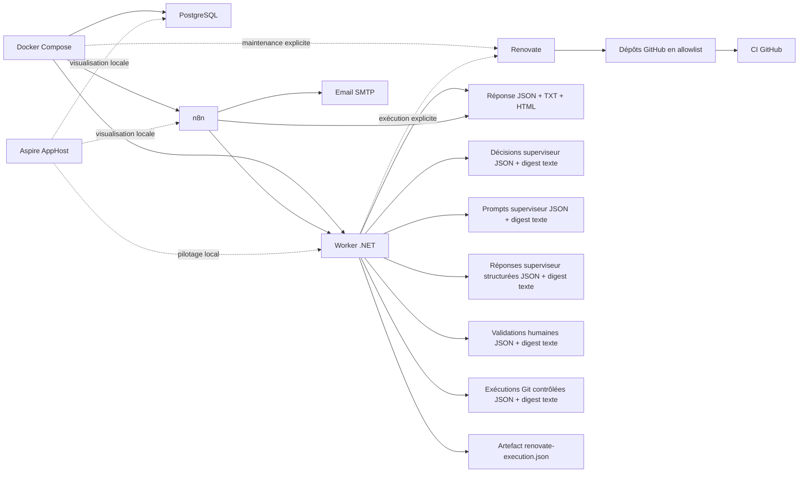

# Architecture cible

`repo-ops` fournit un socle centralisé pour piloter la maintenance de plusieurs dépôts GitHub publics personnels sans couplage fort avec chacun d’eux. Le dépôt est centré sur une couche métier `.NET`, conserve `Docker Compose` comme base d’exécution réelle et utilise `Aspire` comme couche locale de pilotage.

## Principes directeurs

- `Docker Compose` reste la référence d’exécution locale réelle du socle.
- `Aspire` sert au pilotage local, à la visualisation et au confort de développement.
- le worker `.NET` devient la source de vérité du reporting ;
- `n8n` reste utile pour les cron, les déclenchements simples et les notifications ;
- `Renovate` reste la brique dédiée à la maintenance automatisée des dépendances ;
- les scripts existants sont maintenus hors du flux réel principal.

## Flux réel retenu

1. `n8n` déclenche un workflow quotidien.
2. Le workflow appelle `POST /maintenance/run` sur le worker via le réseau Docker interne.
3. Le worker charge le dernier résultat connu d’une exécution explicite de `Renovate`, sans relancer `Renovate` dans ce cycle quotidien.
4. Le worker produit la réponse JSON et les artefacts de sortie :
   - JSON stable
   - texte
   - HTML
   - historique JSON des runs
   - index léger des runs
   - décisions superviseur JSON
   - digest superviseur texte
   - prompts superviseur JSON
   - digest prompts texte
   - réponses superviseur structurées JSON
   - digest des réponses superviseur texte
   - validations humaines JSON
   - digest des validations humaines texte
   - exécutions Git contrôlées JSON
   - digest des exécutions Git contrôlées texte
5. `n8n` consomme le JSON renvoyé directement par le worker.
6. `n8n` envoie l’email à partir du digest déjà produit.

## Rôles des composants

### Docker Compose

[`docker-compose.yml`](../docker-compose.yml) exécute la stack réellement prévue pour le socle.

Par défaut :

- `worker` ;
- `postgres` ;
- `n8n`.

`Renovate` est conservé dans le même fichier, mais derrière un profil explicite de maintenance.

### Worker .NET

[`src/RepoOps.Worker`](../src/RepoOps.Worker) porte la logique métier :

- construction du rapport ;
- rendu du digest ;
- persistance des sorties ;
- mode `run once` exploitable localement ;
- exposition d’une API HTTP minimale pour déclencher un cycle.

Dans l’état actuel, le worker :

- lit `RENOVATE_REPOSITORIES` ;
- interroge GitHub via `GITHUB_TOKEN` ;
- produit un rapport JSON structuré stable ;
- sépare les modèles métier, le rendu du digest et la persistance ;
- génère un sujet, un texte brut et un HTML simples ;
- récupère les PR Renovate ouvertes, les PR Renovate fusionnées récemment et les fermetures récentes sans fusion ;
- récupère les `Dependabot alerts` ouvertes et corrigées quand l’API GitHub les rend disponibles ;
- construit une vue sécurité par dépôt avec les sévérités `critical`, `high`, `medium` et `low` ;
- corrèle de façon prudente certaines PR Renovate avec des vulnérabilités ouvertes lorsque le package et la version corrigée sont identifiables ;
- qualifie les PR ouvertes en `readyForReview`, `blocked` ou `failedChecks` à partir des check-runs et du statut combiné ;
- calcule une décision d’auto-merge par PR (`AutoMerge`, `ManualReview`, `Blocked`, `Failed`) ;
- peut exécuter un merge GitHub réel si la politique est activée et si le mode dry-run est désactivé ;
- peut appliquer des overrides par dépôt via une politique JSON simple ;
- historise chaque exécution avec un `runId`, un statut, une durée et un snapshot de métriques ;
- expose un mode CLI de consultation des derniers runs ;
- produit une première couche de décisions structurées à partir du rapport consolidé ;
- peut émettre le JSON sur `stdout` en mode explicite.

### Observabilité légère

La couche d’observabilité retenue reste volontairement simple :

- aucun service externe ;
- aucun stockage complexe ;
- persistance sur fichiers JSON ;
- consultation locale via CLI.

Chaque run historisé contient :

- le timestamp d’exécution ;
- le statut global ;
- l’origine du déclenchement ;
- la durée ;
- des métriques simples.

Métriques suivies :

- `AnalyzedPullRequests`
- `AutoMergedPullRequests`
- `BlockedPullRequests`
- `ErrorCount`

### Superviseur IA de premier niveau

Le superviseur introduit dans ce lot n’est pas un orchestrateur autonome et n’exécute rien directement.

Il :

- consomme le rapport `MaintenanceRunReport` déjà produit ;
- applique un petit ensemble de règles déterministes et explicables ;
- génère un artefact JSON distinct de décisions ;
- génère un digest texte lisible ;
- expose un mode CLI et un endpoint HTTP dédiés.

Le premier lot de règles retenu est volontairement sobre :

- `patch` + checks verts + décision `AutoMerge` : `AutoMergeEligible`
- `minor` : `Review`
- `major` : `Review` en priorité haute
- checks en échec : `FixRequired`
- vulnérabilité critique : priorité haute

Cette couche ne déclenche encore ni merge, ni PR, ni agent externe. Elle prépare seulement le terrain pour un superviseur plus riche dans les lots suivants.

### Générateur de prompts

Le générateur de prompts se branche directement sur les actions du superviseur.

Il :

- transforme chaque action en prompt structuré ;
- applique un template adapté au type d’action ;
- produit un artefact JSON facilement copiable ;
- produit un digest texte lisible ;
- reste strictement passif : aucun appel Codex, aucune exécution automatique.

Templates de prompts actuellement disponibles :

- correction ciblée pour `FixRequired` ;
- analyse pour `Review` ;
- validation finale pour `AutoMergeEligible` ;
- variante prioritaire sécurité pour une action `FixRequired` liée à une vulnérabilité.

### Exécuteur contrôlé des prompts

L’exécuteur contrôlé se branche après le générateur de prompts et reste strictement passif.

Il :

- consomme un JSON de prompts déjà générés ;
- passe par l’interface `ICodexClient` ;
- utilise un client `Stub` par défaut ;
- produit un JSON distinct de réponses structurées ;
- génère un digest texte lisible ;
- n’exécute aucune action sur les dépôts et ne déclenche aucun commit.

Chaque réponse structurée contient au minimum :

- le prompt initial ;
- la réponse structurée ;
- un résumé ;
- un type de réponse (`Analysis`, `ProposedFix`, `Refactor`) ;
- un niveau de confiance ;
- `requiresHumanValidation` ;
- `readyForExecution`.

Dans l’état actuel, `requiresHumanValidation` reste toujours à `true` et `readyForExecution` reste à `false`.

### Validation Engine

Le moteur de validation humaine se place après l’exécuteur contrôlé.

Il :

- consomme les réponses structurées déjà produites ;
- accepte soit une saisie interactive en CLI, soit un fichier de validation existant ;
- produit une décision humaine explicite par action ;
- génère un JSON de validation et un digest texte ;
- prépare un champ `readyForExecution` pour les étapes futures ;
- n’exécute rien automatiquement.

Les décisions possibles sont :

- `Approved`
- `Rejected`
- `NeedsReview`

Le mode interactif affiche chaque action, son résumé et son niveau de confiance, puis demande une décision et un commentaire libre.
Le mode non interactif charge un fichier de validation contenant les mêmes décisions.

### Commit Engine

Le `Commit Engine` se place après la validation humaine et reste soumis à des garde-fous stricts.

Il :

- consomme les validations humaines et les réponses structurées du client Codex ;
- exige une action `Approved` avec `readyForExecution=true` ;
- exige un patch unifié structuré dans la réponse associée ;
- exige un mapping explicite `dépôt -> workspace local` ;
- clone le dépôt dans un workspace temporaire dédié ;
- contrôle les fichiers ciblés avant application du patch ;
- tente une validation avant commit dans le clone temporaire ;
- crée une branche dédiée ;
- applique le patch ;
- crée un commit ;
- pousse la branche ;
- peut ouvrir une pull request GitHub ;
- reste en `dry-run` par défaut.

Protections retenues :

- aucun push direct vers `main` ou `master` ;
- aucun déclenchement implicite depuis `n8n` ;
- aucun commit sans validation humaine préalable ;
- refus des patchs ambigus ou incohérents ;
- refus des dépôts sources locaux non propres ;
- nettoyage du workspace temporaire après exécution ;
- logs détaillés et digest dédié.

Dans l’état actuel, l’exécution réelle reste surtout une enveloppe sécurisée prête pour un futur client Codex capable de fournir un `proposedUnifiedDiff` exploitable.

### Aspire AppHost

[`src/RepoOps.AppHost`](../src/RepoOps.AppHost) apporte une couche de pilotage local pour Visual Studio et le tableau de bord Aspire.

L’AppHost permet de visualiser localement :

- le projet `worker` ;
- `postgres` ;
- `n8n`.

Choix volontaire dans ce lot : `Renovate` reste hors AppHost. La maintenance explicite continue de relever de `Docker Compose`.

### Renovate

`Renovate` self-hosted détecte les dépendances obsolètes ou vulnérables puis ouvre des pull requests de maintenance sur une allowlist explicite de dépôts.

Dans ce lot :

- il ne tourne plus en boucle infinie ;
- il est déclenché explicitement via le worker `.NET`, qui appelle `docker compose --profile maintenance run --rm renovate` ;
- son dernier résultat connu est persistant et réutilisable par le flux quotidien ;
- il reste attaché au runtime Compose.

### n8n

`n8n` orchestre :

- les déclenchements planifiés ;
- le déclenchement simple du worker via HTTP ;
- la lecture du rapport produit ;
- l’envoi des notifications par email.

Le workflow versionné ne reconstruit plus la synthèse métier. Il se contente de consommer le digest du worker et de l’envoyer.

### Scripts transitoires

Les scripts du dossier `scripts/` restent présents comme utilitaires transitoires, mais ne font plus partie du flux réel retenu pour le reporting quotidien.

## Exécution explicite de Renovate

Commande recommandée pour un cycle supervisé par le worker :

```powershell
dotnet run --project .\src\RepoOps.Worker -- --run-once --run-renovate --emit-json-to-stdout --input-source=manual-renovate
```

Cette commande suppose qu'un `.env` opérationnel existe à la racine du dépôt, ou qu'un argument explicite `RENOVATE_EXECUTION_ARGUMENTS` fournisse l'option `--env-file` adaptée.

Commande brute encore disponible :

```powershell
docker compose --profile maintenance run --rm renovate
```

Commande minimale de validation :

```powershell
docker compose --profile maintenance run --rm renovate --version
```

## Répartition des responsabilités

### Ce qui relève de Docker Compose

- exécuter réellement les services locaux ;
- distinguer la stack principale et les tâches de maintenance explicites ;
- rester indépendant de l’IDE.

### Ce qui relève d’Aspire

- visualiser les ressources en local ;
- faciliter le démarrage et l’observation dans Visual Studio ;
- garder une expérience de développement cohérente autour de la couche `.NET`.

### Ce qui relève du Worker .NET

- porter la logique métier de collecte GitHub, consolidation et synthèse ;
- produire le contrat de sortie de référence ;
- historiser les runs et exposer leur consultation locale ;
- qualifier les PR Renovate pour aider la décision opérationnelle ;
- intégrer une première couche de reporting sécurité à partir des `Dependabot alerts` ;
- décider si une PR Renovate doit être auto-mergée, revue manuellement ou bloquée ;
- exécuter éventuellement le merge GitHub réel dans un mode explicitement activé ;
- superviser l’exécution explicite de `Renovate` et en conserver un artefact exploitable ;
- fournir les artefacts consommés par `n8n`.
- fournir des artefacts superviseur supplémentaires pour la relecture humaine, sans automatisation d’exécution.
- porter la chaîne de validation humaine avant toute exécution future contrôlée.
- porter le `Commit Engine` et ses garde-fous pour une exécution locale strictement contrôlée.

## Règles d’auto-merge retenues

- origine `Renovate` obligatoire ;
- PR ouverte et non brouillon ;
- checks GitHub qualifiés en succès ;
- `mergeable = true` et `mergeable_state = clean` ;
- mises à jour `major` en revue manuelle ;
- mises à jour `minor` en revue manuelle tant qu’elles ne sont pas explicitement autorisées ;
- mises à jour `patch` éligibles selon la politique configurée ;
- `mergeable_state` accepté explicitement par la politique, avec `clean` par défaut ;
- overrides par dépôt sur un matching exact `owner/repo` ;
- mode dry-run actif par défaut.

## Overrides par dépôt

Le système distingue :

- une politique globale, stricte par défaut ;
- des overrides par dépôt, chargés depuis `RepoOps:AutoMerge:RepositoryPolicies` ou depuis un fichier JSON externe pointé par `AUTOMERGE_POLICY_FILE_PATH`.

Chaque override peut :

- autoriser ou interdire l’auto-merge ;
- forcer une revue manuelle ;
- déclarer un dépôt en lecture seule ;
- restreindre les types de mise à jour autorisés ;
- imposer une méthode de merge spécifique.

### Ce qui relève encore de n8n

- les `Cron` ;
- le déclenchement simple du worker ;
- l’envoi de l’email ;
- la configuration manuelle des credentials SMTP.

## Limites actuelles

- la collecte GitHub reste limitée au périmètre REST minimal utile à ce lot ;
- la lecture des `Dependabot alerts` dépend des droits du jeton GitHub et peut être indisponible selon les dépôts ciblés ;
- les alertes corrigées dépendent de ce que l’API GitHub expose effectivement pour le dépôt ;
- la corrélation d’une PR Renovate avec une vulnérabilité reste volontairement stricte et peut manquer des cas pourtant pertinents ;
- la qualification des PR ouvertes dépend encore de la disponibilité des check-runs et du statut combiné sur chaque dépôt ;
- le type de version est déduit des labels GitHub ou du titre de PR quand la comparaison sémantique est possible ;
- la qualification d’une exécution `Renovate` reste basée sur l’analyse de ses logs, pas sur un rapport structuré natif stabilisé ;
- l’auto-merge réel reste conservateur et peut refuser des PR pourtant mergeables si le contexte GitHub n’est pas strictement `clean` ;
- les overrides par dépôt ne prennent pas encore en charge des motifs globaux ou des groupes de dépôts ;
- l’API HTTP du worker reste locale au réseau Docker et ne porte pas encore de mécanisme d’authentification dédié ;
- le superviseur actuel repose uniquement sur des règles codées en dur et n’utilise encore ni planification multi-étapes ni agents d’implémentation ;
- le générateur de prompts repose lui aussi sur des templates codés en dur et devra être enrichi progressivement ;
- l’exécuteur contrôlé repose actuellement sur un client `Stub` déterministe et n’appelle aucun service externe réel ;
- les réponses générées ne doivent pas être interprétées comme des ordres d’exécution ; elles restent des propositions à valider manuellement ;
- la validation humaine reste locale au worker et n’est pas encore exposée dans `n8n` ;
- `readyForExecution` est un état préparatoire uniquement ; aucun moteur d’exécution contrôlée n’est encore branché ;
- le `Commit Engine` n’est pas appelé par `n8n` et reste un flux CLI explicite ;
- le `Commit Engine` ne peut agir réellement que si la réponse structurée contient un `proposedUnifiedDiff` ;
- le client `Stub` actuel ne produit pas de patch unifié, ce qui maintient les exécutions au niveau du dry-run ou du `skipped` contrôlé ;
- la validation avant commit reste volontairement simple et repose principalement sur `dotnet build` quand un dépôt `.NET` est détecté ;
- l’observabilité reste locale et n’expose pas encore de vue agrégée plus riche que l’historique JSON et la consultation CLI ;
- l'intégration GitHub n'exploite pas encore les issues, les dépendances de sécurité ni l'historique détaillé d'exécution de Renovate ;
- le flux quotidien n8n ne relance pas `Renovate` automatiquement ; il exploite le dernier résultat connu.

## Diagramme


