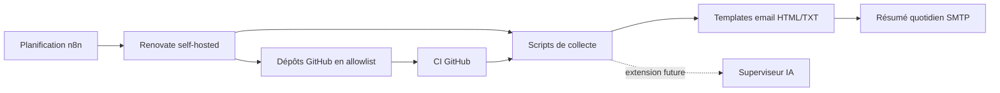

# Architecture cible

Ce dépôt fournit un socle centralisé pour piloter la maintenance de plusieurs dépôts GitHub publics personnels sans couplage fort avec chacun d’eux.

## Rôles des composants

### Renovate

`Renovate` self-hosted détecte les dépendances obsolètes ou vulnérables, puis ouvre des pull requests de maintenance sur une allowlist explicite de dépôts. Il reste volontairement désactivé sur l’autodiscovery globale afin de garder la maîtrise du périmètre.

### n8n

`n8n` orchestre les déclenchements, les exécutions planifiées, les enchaînements futurs avec les scripts de collecte et l’envoi des synthèses. Dans le premier jet, il sert surtout de point d’entrée d’orchestration et de supervision légère.

### Scripts

Les scripts du dossier `scripts/` portent la logique opérationnelle qui ne relève ni de `Renovate` ni de `n8n` :

- collecte des résultats de scan, des pull requests créées et des échecs éventuels ;
- préparation d’un modèle de données consolidé ;
- point d’intégration futur pour des règles métiers plus fines.

### Templates d’email

Les templates HTML et texte brut définissent un format de synthèse quotidien homogène, exploitable par un envoi SMTP simple et compréhensible sans dépendance à un client spécifique.

### Futur superviseur IA

Un superviseur IA pourra plus tard enrichir le socle pour :

- prioriser les dépôts selon leur criticité ;
- interpréter des échecs de CI ou des conflits de mise à jour ;
- recommander des actions manuelles ciblées ;
- consolider des signaux de qualité sur plusieurs dépôts.

Cette brique n’est pas implémentée dans le premier jet afin de conserver un socle robuste et minimal.

## Diagramme

