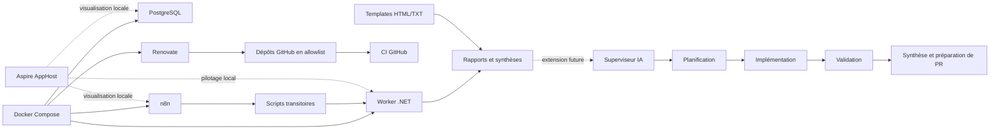

# Architecture cible

`repo-ops` fournit un socle centralisé pour piloter la maintenance de plusieurs dépôts GitHub publics personnels sans couplage fort avec chacun d’eux. Le dépôt est désormais centré sur une couche métier `.NET`, tout en conservant `Docker Compose` comme base d’exécution réelle et `Aspire` comme couche locale de pilotage.

## Principes directeurs

- `Docker Compose` reste la référence d’exécution locale réelle du socle.
- `Aspire` sert au pilotage local, à la visualisation et au confort de développement.
- le worker `.NET` devient progressivement la couche métier principale ;
- `n8n` reste utile pour les cron, les enchaînements simples et les notifications ;
- `Renovate` reste la brique dédiée à la maintenance automatisée des dépendances ;
- les scripts existants sont maintenus comme solution transitoire, pas comme cible architecturale.

## Rôles des composants

### Docker Compose

[`docker-compose.yml`](../docker-compose.yml) exécute la stack réellement prévue pour le socle :

- `worker` ;
- `postgres` ;
- `n8n` ;
- `renovate`.

Cette couche doit rester simple, robuste et directement exploitable sans dépendance à Visual Studio.

### Worker .NET

[`src/RepoOps.Worker`](../src/RepoOps.Worker) porte la future logique métier :

- collecte des résultats ;
- consolidation ;
- génération de synthèse ;
- future base pour une logique de supervision plus avancée.

Dans l’état actuel, le worker :

- journalise des cycles d’exécution ;
- lit `RENOVATE_REPOSITORIES` ;
- produit un rapport placeholder structuré ;
- écrit une synthèse texte locale dans `reports/`.

Il ne simule pas de branchement GitHub réel et ne prétend pas piloter déjà des dépôts tiers.

### Aspire AppHost

[`src/RepoOps.AppHost`](../src/RepoOps.AppHost) apporte une couche de pilotage local pour Visual Studio et le tableau de bord Aspire.

L’AppHost permet de visualiser localement :

- le projet `worker` ;
- `postgres` ;
- `n8n`.

Choix volontaire : `Renovate` reste principalement attaché à la stack `Docker Compose`. Cela évite d’alourdir inutilement l’AppHost alors que son rôle est d’abord local et exploratoire.

### Renovate

`Renovate` self-hosted détecte les dépendances obsolètes ou vulnérables puis ouvre des pull requests de maintenance sur une allowlist explicite de dépôts. L’autodiscovery globale reste désactivée pour garder la maîtrise du périmètre.

### n8n

`n8n` orchestre :

- les déclenchements planifiés ;
- les enchaînements simples ;
- l’import de workflows versionnés ;
- l’envoi des notifications par email.

Le workflow quotidien versionné suit encore une chaîne de transition :

- `Cron` quotidien ;
- préparation du contexte ;
- appel d’un script local ;
- mise en forme d’une synthèse ;
- envoi d’un email.

### Scripts transitoires

Les scripts du dossier `scripts/` restent présents pour préserver la compatibilité avec le workflow `n8n` existant. Ils servent de passerelle temporaire entre l’orchestration JSON et la future logique portée par le worker `.NET`.

Leur rôle doit décroître progressivement au profit de services `.NET` explicites.

### Templates d’email

Les templates HTML et texte brut définissent un format de synthèse homogène, réutilisable par `n8n` aujourd’hui et plus tard par la couche `.NET` si l’envoi ou la préparation du contenu migre.

## Répartition des responsabilités

### Ce qui relève de Docker Compose

- exécuter réellement les services locaux ;
- conserver une base simple et scriptable ;
- rester indépendant de l’IDE.

### Ce qui relève d’Aspire

- visualiser les ressources en local ;
- faciliter le démarrage et l’observation dans Visual Studio ;
- accélérer le développement autour de la couche `.NET`.

### Ce qui relève du Worker .NET

- porter la logique métier de collecte, consolidation et synthèse ;
- remplacer progressivement les placeholders shell et PowerShell ;
- préparer l’extension future vers un superviseur plus avancé.

### Ce qui relève encore de n8n

- les `Cron` ;
- les enchaînements simples ;
- les notifications ;
- l’import et l’édition manuelle de workflows côté instance locale.

## Futur superviseur IA

Le superviseur IA reste une extension future du socle. Il devra se brancher sur la couche `.NET`, pas court-circuiter les fondations existantes.

Rôle visé :

- planifier des tâches incrémentales ;
- déléguer l’implémentation ;
- déclencher ou vérifier les validations ;
- produire une synthèse claire et bornée ;
- préparer une PR sans contourner les règles locales.

Contraintes à préserver :

- respect des instructions projet de type `AGENTS.md` ;
- absence de secret en dur ;
- absence d’action non réversible sans politique explicite ;
- séparation claire entre orchestration, implémentation, validation et reporting.

## Diagramme

