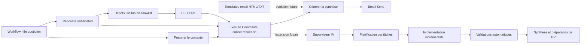

# Architecture cible

Ce dépôt fournit un socle centralisé pour piloter la maintenance de plusieurs dépôts GitHub publics personnels sans couplage fort avec chacun d’eux.

## Rôles des composants

### Renovate

`Renovate` self-hosted détecte les dépendances obsolètes ou vulnérables, puis ouvre des pull requests de maintenance sur une allowlist explicite de dépôts. Il reste volontairement désactivé sur l’autodiscovery globale afin de garder la maîtrise du périmètre.

### n8n

`n8n` orchestre les déclenchements, les exécutions planifiées, les enchaînements futurs avec les scripts de collecte et l’envoi des synthèses. Dans le premier jet, il s’appuie sur des workflows JSON versionnés dans le dépôt pour garder une base relisible, importable et testable localement.

Le workflow quotidien prévu suit la séquence suivante :

- `Cron` quotidien ;
- préparation du contexte d’exécution ;
- appel d’un script local via `Execute Command` ;
- génération d’une synthèse ;
- envoi d’un email.

### Scripts

Les scripts du dossier `scripts/` portent la logique opérationnelle qui ne relève ni de `Renovate` ni de `n8n` :

- collecte des résultats de scan, des pull requests créées et des échecs éventuels ;
- préparation d’un modèle de données consolidé ;
- point d’intégration futur pour des règles métiers plus fines.

Dans le lot actuel, [`scripts/collect-results.sh`](../scripts/collect-results.sh) sert de contrat d’échange entre le workflow `n8n` et la future collecte réelle. Il retourne déjà un JSON stable afin de permettre l’import et le test du workflow sans dépendre de l’environnement final.

### Templates d’email

Les templates HTML et texte brut définissent un format de synthèse quotidien homogène, exploitable par un envoi SMTP simple et compréhensible sans dépendance à un client spécifique.

### Futur superviseur IA

Un superviseur IA pourra plus tard enrichir le socle pour :

- prioriser les dépôts selon leur criticité ;
- interpréter des échecs de CI ou des conflits de mise à jour ;
- recommander des actions manuelles ciblées ;
- consolider des signaux de qualité sur plusieurs dépôts.

Cette brique n’est pas implémentée dans le premier jet afin de conserver un socle robuste et minimal.

## Extension future : superviseur IA de delivery

L’évolution naturelle de `repo-ops` est d’ajouter un superviseur IA capable de piloter des tâches de développement incrémentales sur plusieurs dépôts, tout en restant compatible avec les contraintes réelles de chaque projet.

Principes d’intégration visés :

- lecture des instructions locales de type `AGENTS.md` dans chaque dépôt ciblé ;
- découpage du travail en tâches courtes, auditées et rejouables ;
- exécution bornée par étape, avec validation explicite avant progression ;
- production systématique d’une synthèse lisible pour l’humain ;
- absence d’action directe non réversible sur les dépôts tiers sans validation explicite.

Le superviseur IA devra s’insérer dans le socle existant comme une couche d’orchestration complémentaire, et non comme un remplacement de `Renovate`, `n8n` ou des validations CI existantes.

Responsabilités futures attendues :

- sélectionner un dépôt et un objectif de travail ;
- formuler un plan d’exécution à granularité contrôlée ;
- déléguer l’implémentation à des agents spécialisés ;
- déclencher ou vérifier les validations locales et CI ;
- consolider un état de sortie exploitable pour revue ou ouverture de PR.

Limites de sécurité à préserver :

- ne pas contourner les politiques décrites dans les `AGENTS.md` des dépôts cibles ;
- ne pas inventer de secrets, de credentials ou d’états externes ;
- ne pas pousser automatiquement vers un dépôt tiers sans politique explicite ;
- ne pas fusionner automatiquement une PR sans garde-fous clairement définis.

Structure cible, à préparer plus tard mais sans l’implémenter maintenant :

```text
repo-ops/
  docs/
    ai-supervisor-design.md
  templates/
    agent-task-template.md
  supervisor/
    planners/
    tasks/
    reports/
    policies/
```

## Diagramme


